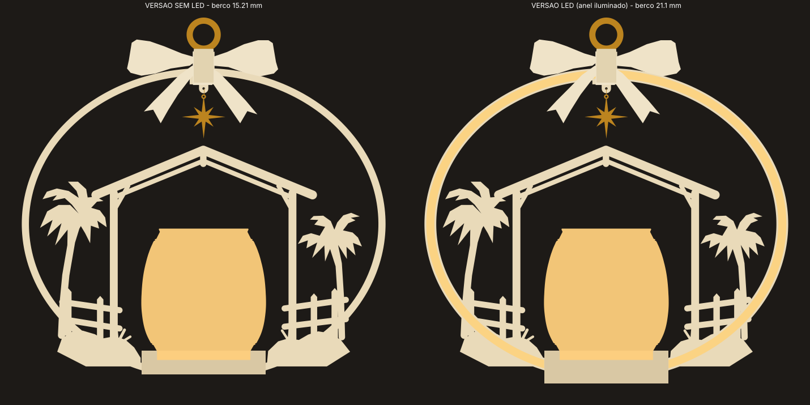

# Arco Presépio v2: guia de produção

Duas versões que usam a mesma arte, o mesmo copo de 80 mm e o mesmo laço:

| | SEM LED | LED |
|---|---|---|
| Arco | 2 metades de 3,0 mm (total de 6,0 mm), com filete gravado nas duas faces | 2 metades de 3,0 mm, anel de 7,6 mm com câmara de luz interna |
| Face de vitrine | Para cima na impressão (o filete sai nítido) | Na mesa (face lisa, com textura da placa) |
| Alinhamento | 14 cavilhas de filamento de 1,75 mm | 6 cavilhas de filamento de 1,75 mm |
| Berço do copo | 15,2 mm de altura | 21,1 mm, com compartimento de pilha e canal do fio |
| Tempo (fatiado e calibrado) | ~4h05 de impressão (+~25 min de preparo, 4 pratos) | ~4h20 de impressão (+~25 min de preparo, 4 pratos) |
| Filamento | ~100 g de marfim + ~3 g de dourado | ~110 g de marfim + ~3 g de dourado |

Os tempos vêm do PrusaSlicer com o perfil abaixo, corrigidos por um fator de 1,07. O fator saiu da comparação com o seu arco original: o Bambu estimou 2h13 e o Prusa, 2h04. **Confirme no Bambu Studio.**

## Revisão 2: depois dos testes de 07/10

| Teste | Resultado | Mudança |
|---|---|---|
| Trava do copo 0,25 | Não funcionou: o copo é uma esfera cortada, sem pé, e o bojo encosta antes | Os dedos saíram. Entrou um **assento cônico de 4,5 mm** que copia a base do vaso (escala do arquivo: 80,9 × 80,9 × 80) com folga de 0,2. A arte do vaso começa a ~4,8 mm, então nada fica coberto |
| Pinos do teste de luz | Furo +0,3 não entrou, +0,5 entrou | Todas as folgas passaram para **0,25 mm radial**: cavilha Ø2,25, haste do pino Ø2,9, bolso da argola e fenda do berço |
| Luz (impresso em azul) | Não se via a luz | Estrelas de 4 pontas a cada 9 mm nas duas faces do anel + **janelas na borda externa** a cada 18 mm (luz saindo para fora) |

**Retenção do copo:** o assento cônico centraliza o copo e o segura de lado. Contra o balanço normal da guirlanda, o peso do copo basta. Os ímãs são **opcionais**, só para porta que bate com força (`IMAS_ASSENTO` em `src/gerar.py`). Vem desligado.

**Estrelas:**
- `MODO_ESTRELA = 'janela'`: a estrela é uma pele de 0,4 mm por dentro. Apagada fica invisível; acesa aparece.
- `MODO_ESTRELA = 'furo'`: a estrela é vazada.
- O `TESTE_LUZ_SEGMENTO` traz os dois modos: janela em cima, vazado embaixo.

**Cor:** azul e cores escuras bloqueiam a luz. Use marfim ou branco / natural translúcido.

**Revisão 4: depois do teste em PLA branco (vídeo de 07/10)**
- **Encaixe das metades do arco LED:** a frente tem uma **nervura** de 0,5 × 0,8 mm na parede externa do anel e o verso tem a **canaleta** correspondente (0,8 × 1,0 mm). As metades se alinham sozinhas e a nervura veda a luz na emenda. A parede externa passou de 1,2 para 1,8 mm para comportar o encaixe.
- **Copo preso na guirlanda:** **3 pares de ímãs** (3,95 × 1,89 mm).
  - **No berço:** 3 bolsos no piso do assento, a 16 mm do centro, a 30°/150°/270°.
  - **No copo:** cole os 3 ímãs **por dentro**, no piso, nas mesmas posições (um círculo de 32 mm de diâmetro, a 120°). Eles ficam escondidos debaixo da vela.
  - O fundo do copo tem só ~1,3 mm, por isso não dá para fazer bolso por baixo.
  - Os ímãs também giram o copo sozinho para uma das 3 posições.
  - **Polaridade:** monte os pares primeiro (copo + berço), marque a face que atrai e só depois cole.

**Berço LED: gaveta da pilha (revisão 3)**
- A caixinha entra **por trás do berço**, deitada (tampa da pilha para baixo), com a **lateral da chave virada para fora**, rente à borda.
- Para ligar e desligar, basta alcançar atrás do berço, sem levantar o arco. Na guirlanda, a chave fica virada para a parede.
- Um ressalto de 0,35 mm no piso da gaveta segura a caixinha com um clique.
- Há túnel de fio nas **duas pontas** da gaveta, então a caixinha pode entrar virada para qualquer lado: a chave sempre fica para fora.
- A tampa de baixo deixou de existir, e o fundo do berço ficou liso.
- Ímãs: 3,95 × 1,89 mm, em bolsos de Ø4,15 × 2,1 mm (só para o plinto opcional).

## O que mudou em relação ao projeto de 7 pratos

- **Sem parafusos, porcas, garfo, pé removível, calços nem espaçadores.**
- O **berço** é uma sela que desce sobre a base achatada do anel e é colada. Ele já é a base de bancada: largura de 80 mm.
  - Estimativa de tombamento: ~28°, contando arco, copo e vela. A conta usa a massa estimada do copo com a vela.
  - Na guirlanda, ele fica como o prato sob o copo, igual à referência 2.
- **Retenção do copo:** um bolso em "D" do mesmo formato do pé atual do copo (Ø60 com chanfro reto) mais 3 dedos flexíveis com trava.
  - A trava encaixa no pequeno rebaixo que já existe acima do pé do copo. O copo entra com um clique e não sai quando a guirlanda balança.
  - **Não é preciso mudar o copo.**
- A **argola dourada v2** é a original com a lingueta cortada. Ela fica presa entre as metades, num bolso, e o pino do laço passa pelo furo dela.
- **Orelha para a estrela** logo abaixo do nó do laço, com furo de Ø1,6 mm para a linha.
- **Friso em "V":** cada metade tem chanfro de 0,4 mm na borda de colagem, então a linha de cola fica escondida num friso intencional.

## Projetos prontos do Bambu Studio (`3mf/`)

- `PRESEPIO_v2_SEM_LED.3mf` e `PRESEPIO_v2_LED.3mf`: 6 placas cada. Os filamentos já estão atribuídos (1 = marfim, 2 = dourado) e o perfil recomendado abaixo já está aplicado.
- As placas: 01 teste da trava do copo, 02 arco frente, 03 arco verso, 04 berço + laços + nós + pinos (+ tampa na versão LED), 05 dourado, 06 plinto opcional.
- O projeto vem **sem fatiamento**. Clique em "Slice all" e confira os tempos.
- Para regenerar: `python3 src/montar_3mf.py <3mf_original_extraido> stl 3mf`

## Arquivos (`stl/`): todos já orientados para imprimir

| Arquivo | Qtd | Cor | Observação |
|---|---|---|---|
| `SEM_LED_01_ARCO_FRENTE` / `_VERSO` | 1 + 1 | marfim | Um prato para cada (234 × 206 mm) |
| `SEM_LED_02_BERCO_COPO` | 1 | marfim | |
| `LED_01_ARCO_FRENTE` / `_VERSO` | 1 + 1 | marfim | Câmara de luz voltada para cima |
| `LED_02_BERCO_COPO` | 1 | marfim | Compartimento **provisório** (ver Pendências) |
| `COMUM_LACO_FRENTE_original` / `_VERSO_original` | 1 + 1 | marfim | Sem alteração |
| `COMUM_NO_LACO_original_imprimir_2x` | 2 | marfim | O mesmo nó na frente e no verso |
| `COMUM_PINO_LACO` | 2 (sem LED) / 1 (LED) | marfim | Imprima 1 a mais de reserva |
| `COMUM_ARGOLA_DOURADA_v2` | 1 | dourado | |
| `COMUM_ESTRELA_FRENTE_original` / `_VERSO_original` | 1 + 1 | dourado | |
| `COMUM_PLINTO_BANCADA_opcional` | 1 | marfim | Acessório opcional. Ímãs **provisórios** de Ø8 × 3 mm |
| `TESTE_ENCAIXE_COPO_15` / `_25` / `_35` | 1 de cada | marfim | Teste da trava do copo (~22 min cada) |

**Pratos sugeridos (P1S sem AMS):**
1. Arco frente.
2. Arco verso.
3. Berço + laços + 2 nós + pinos (+ tampa, na versão LED).
4. Dourado: argola + 2 estrelas.

## Antes da produção: 2 testes

1. **Trava do copo.** Imprima o `TESTE_ENCAIXE_COPO_25` (22 min). Encaixe o copo com o chanfro do pé alinhado ao chanfro do bolso.
   - Ideal: entra com um clique firme e sai com um puxão firme.
   - Se estiver frouxo, teste o `_35`. Se estiver duro demais, teste o `_15`.
   - Me diga qual ficou melhor e eu regenero o berço.
2. **Luz (só LED).** Use a tira `teste_canal_luz` que você já tem para escolher a pele (0,6, 0,8 ou 1,0 mm).
   - O padrão do arco é **0,8 mm**.
   - Atenção: a câmara do anel tem 5,2 mm de largura por 4,4 mm de altura, mais estreita que a tira de teste. Ela comporta o fio em uma ou duas passadas, mas sem zigue-zague.
   - O percurso do fio dentro do arco é de **~60 cm**.

## Fatiamento (Bambu Studio)

Os mesmos valores servem para todas as peças marfim. Os menus ficam na coluna esquerda, aba **Process**:

- **Quality**
  - **Layer height: 0,20 mm.** Os chanfros foram modelados em degraus de 0,2 mm, alinhados com a camada. Com outra altura, eles ficam serrilhados.
  - **Elephant foot compensation: 0,15 mm.** Mantém o vazado e os furos da primeira camada no tamanho certo.
- **Strength**
  - **Wall loops: 3.** Paredes de 1,2 mm (câmara, dedos do berço, partes finas da arte) ficam 100% em parede, sem preenchimento.
  - **Top shell layers: 4.**
  - **Bottom shell layers: 5.** É obrigatório na versão LED: 5 × 0,2 = 1,0 mm, o que garante a pele de 0,8 mm totalmente sólida, sem padrão de preenchimento aparecendo contra a luz.
  - **Sparse infill: 15 %, Gyroid.**
- **Speed**
  - **Outer wall: 120 mm/s.** O seu perfil estava em 40. Nessas peças, a parede externa é só a borda de 3 mm, então não precisa ser lenta.
  - Inner wall: 200. Top surface: 150. Sparse infill: 300.
- **Support: desligado em tudo.** Todas as peças foram modeladas sem balanço, e as pontes têm no máximo ~26 mm (teto do compartimento de pilha).
- **Face de vitrine (só LED):**
  - Placa **Textured PEI**: acabamento fosco, próximo de cerâmica.
  - Placa **Cool/Smooth**: acabamento liso e brilhante.
  - Escolha pelo efeito que você quer.
- **Sem LED, face superior:** Top surface pattern: **Monotonic line**. Deixe o ironing desligado no primeiro teste, porque ele pode arredondar a borda do filete.
- **Dourado (argola e estrelas):** layer height de 0,12–0,16 mm, que deixa a estrela mais nítida.

## Montagem: SEM LED

1. Corte **14 cavilhas** de filamento PLA de 1,75 mm com **3,6 mm** cada. Os furos têm 2,0 mm de profundidade de cada lado.
2. **Montagem a seco:** cavilhas nos furos da frente, argola no bolso da aba, verso por cima. Confira o alinhamento.
3. Desmonte e passe **cola CA gel em pontos**, a ~2 mm das bordas, para a cola não escorrer no friso. Feche e prense por 1 minuto.
4. **Laço:**
   - Pino (cabeça na frente) → laço frente → arco (atravessando a argola) → laço verso. São 2 pinos.
   - Ponto de cola nos laços. Cole os nós por cima, escondendo as cabeças dos pinos.
5. **Berço:**
   - Desça o berço sobre a base achatada do anel. A fenda tem 6,3 mm e o formato do arco.
   - Antes, passe cola nas paredes da fenda.
   - O chanfro do bolso fica virado para o **lado direito** (palmeira da direita), como na base original.
6. **Estrela:** cole as duas metades. Passe uma linha de nylon ou um fio dourado pela orelha (Ø1,6 mm), deixando a estrela ~4 mm abaixo. Mais que isso, ela encosta no telhado do estábulo.
7. **Copo:** alinhe o chanfro do pé com o chanfro do bolso e empurre até clicar.

## Montagem: LED

Igual à versão sem LED, com estas diferenças:

1. Antes de colar, **acenda o fio** e teste.
2. **Passe o fio:**
   - Ele entra pelo furo na base da sola, do lado esquerdo (x ≈ −30), segue pelo canal da sola até o anel esquerdo, contorna o anel por cima e termina no lado direito, perto do berço.
   - O excesso de fio pode voltar pela mesma câmara (cabem 2 passadas) ou ficar enrolado no compartimento.
3. **Cola só fora da câmara:** terreno, sola, aba e paredes externas. Nunca dentro do canal.
4. **Berço LED:**
   - O fio sai da sola, desce pela fenda aberta e entra no compartimento pelo canal do fundo.
   - A caixa de pilha vai no compartimento. Feche com a tampa (encaixe por atrito).
5. São **6 cavilhas** e **1 pino** no laço (o furo de baixo não existe, porque a câmara passa ali).

## Pendências (preciso que você meça)

1. **Caixa de pilha do fio anjo:** comprimento × largura × altura, e onde fica o botão. O compartimento atual é **provisório**: 38 × 26 × 12 mm.
2. **Ímãs**, se for usar o plinto: diâmetro × altura. O padrão provisório é Ø8 × 3 mm, em bolsos de Ø8,2 × 3,2 mm para colar.
3. Qual teste de trava ficou melhor (0,15 / 0,25 / 0,35 mm).
4. Qual pele de luz ficou melhor (0,6 / 0,8 / 1,0 mm).

Com esses valores, basta mudar os parâmetros no início de `src/gerar.py` e rodar o script de novo. Tudo é regenerado, incluindo as verificações de colisão (`stl/relatorio.json`).

## Verificações automáticas (relatorio.json)

- Malhas fechadas (estanques) em todas as peças.
- Colisão copo × arco: **0 mm²** nas duas versões, com 1 mm de folga mínima no perfil.
- Interferência berço × arco montado: **0 mm³** nas quatro metades.
- A fenda do berço foi "varrida" verticalmente, então o berço desce sobre o anel fechado sem travar.
- Folga do topo do copo até o telhado do estábulo: o topo do copo fica em y = −7,8 mm e a viga do telhado começa em y ≈ +13 mm nos pilares.
